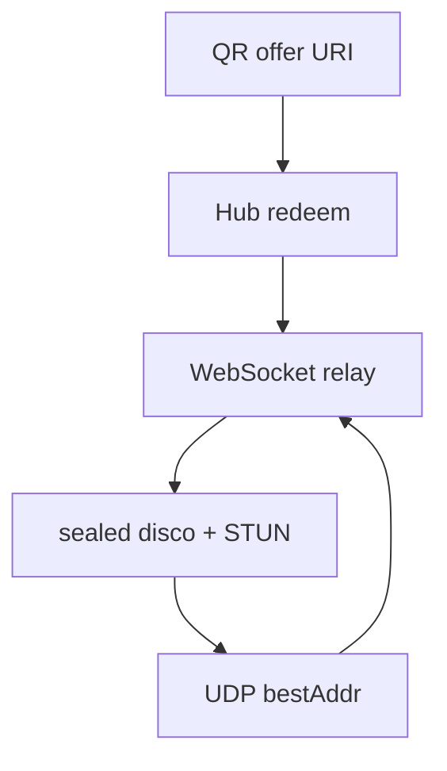

# Architecture

- `protocol` — offer URI, frames, disco JSON, display-label sanitizer
- `crypto` — X25519 identity, KK-style handshake, ChaCha20-Poly1305
- `store` — hosts, pairings, bindings, metadata trace. `Memory` or SQLite
- `relay` — HTTP + WebSocket hub, STUN-lite UDP, admin snapshot
- `client` — host/device, relay-first send, punch loop, fallback, hub
  WebSocket keepalive + reconnect so presence matches HTTP pairing
- `qr` — PNG for desktop UI / mobile camera
- `demo/mobile` — phone page: scan, redeem `name`/`model`, announce `TypeLabel` then `relay`
- `examples/pc` — register hostname, show QR, print local path after handshake

Wire rules: [docs/PROTOCOL.md](docs/PROTOCOL.md). The admin page reads labels
from the store and the path from `Hub.LinkPath`. It does not open `TypeData`.

## Embedding

A product server embeds `relay.Hub` and implements `store.Store` in its own
database. It does not open a second SQLite file, copy frames, or mount
`/pairlink/admin` (those routes stay dark until `SetAdminToken`).

- `Host.Name` is the announced hostname (register, or a later `TypeLabel` on
  the host socket). A product display name stays in the product table.
- `Binding.DeviceName` and `Binding.DeviceModel` round-trip from redeem
  `name` and `model`, and from a later `TypeLabel` on that device socket.
  `SetDeviceLabels` is the store method. Empty does not mean the fingerprint,
  and a name is not parsed into a model.
- Live path is `Hub.LinkPath`: `relay`, `direct`, or empty. Empty is "no fresh
  announcement" for that phone pair. A UI may label the phone offline. Do not
  store the path.
- PC presence is `Hub.PeerOnline(hostPub)`, also `hosts[].online` on the admin
  snapshot. A registered host with a live websocket is online when it has no
  binding and when every phone is offline. An empty `LinkPath` is not "PC
  offline". A host socket does not stamp `Binding.LastConnected`.
- `Binding.LastConnected` moves forward when that device websocket is accepted
  or dropped. `NoteDeviceSeen` is the store method. A host socket does not
  stamp phone rows. Zero means never observed.
