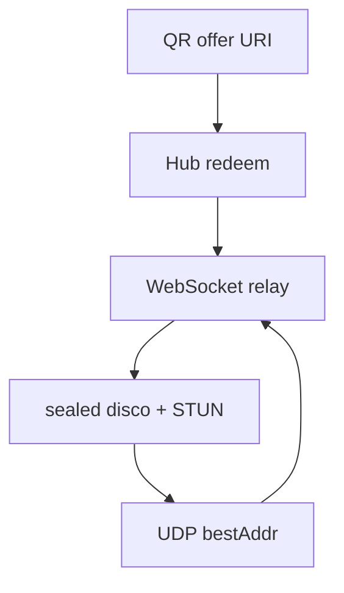

# Architecture

- `protocol` — offer URI, frames, disco JSON
- `crypto` — X25519 identity, KK-style handshake, ChaCha20-Poly1305
- `store` — hosts, pairings, bindings, metadata trace
- `relay` — HTTP + WebSocket hub, STUN-lite UDP
- `client` — host/device, relay-first send, punch loop, fallback, hub
  WebSocket keepalive + reconnect so presence matches HTTP pairing

- `qr` — PNG for desktop UI / mobile camera
