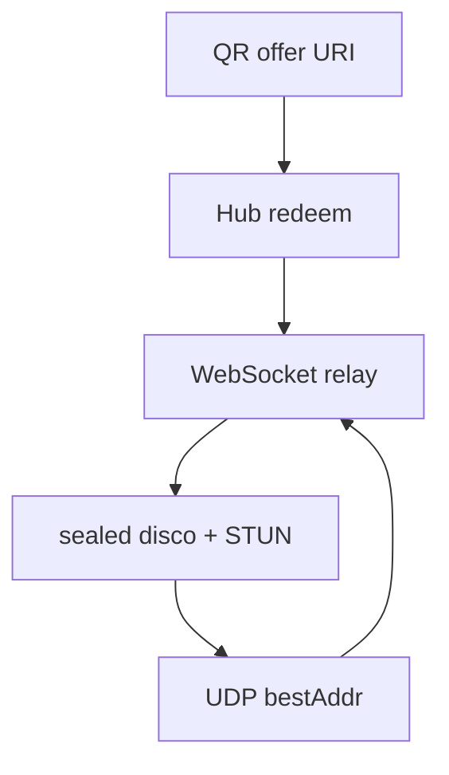

# Architecture

- `protocol` — offer URI, frames, disco JSON, display-label sanitizer
- `crypto` — X25519 identity, KK-style handshake, ChaCha20-Poly1305
- `store` — hosts, pairings, bindings, metadata trace. `Memory` or SQLite
- `relay` — HTTP + WebSocket hub, STUN-lite UDP, admin snapshot
- `client` — host/device, relay-first send, punch loop, fallback, hub
  WebSocket keepalive + reconnect so presence matches HTTP pairing
- `qr` — PNG for desktop UI / mobile camera
- `demo/mobile` — phone page: scan, redeem `name`/`model`, announce `relay`
- `examples/pc` — register hostname, show QR, print local path after handshake

Wire rules: [docs/PROTOCOL.md](docs/PROTOCOL.md). The admin page reads labels
from the store and the path from `Hub.LinkPath`. It does not open `TypeData`.

## Embedding

A product server embeds `relay.Hub` and implements `store.Store` in its own
database. It does not open a second SQLite file, copy frames, or mount
`/pairlink/admin` (those routes stay dark until `SetAdminToken`).

- `Host.Name` is the announced hostname. A product display name stays in the
  product table.
- `Binding.DeviceName` and `Binding.DeviceModel` round-trip from redeem
  `name` and `model`. Empty does not mean the fingerprint.
- Live path is `Hub.LinkPath`: `relay`, `direct`, or empty. Empty is "no fresh
  announcement". A UI may label that offline. Do not store the path.
